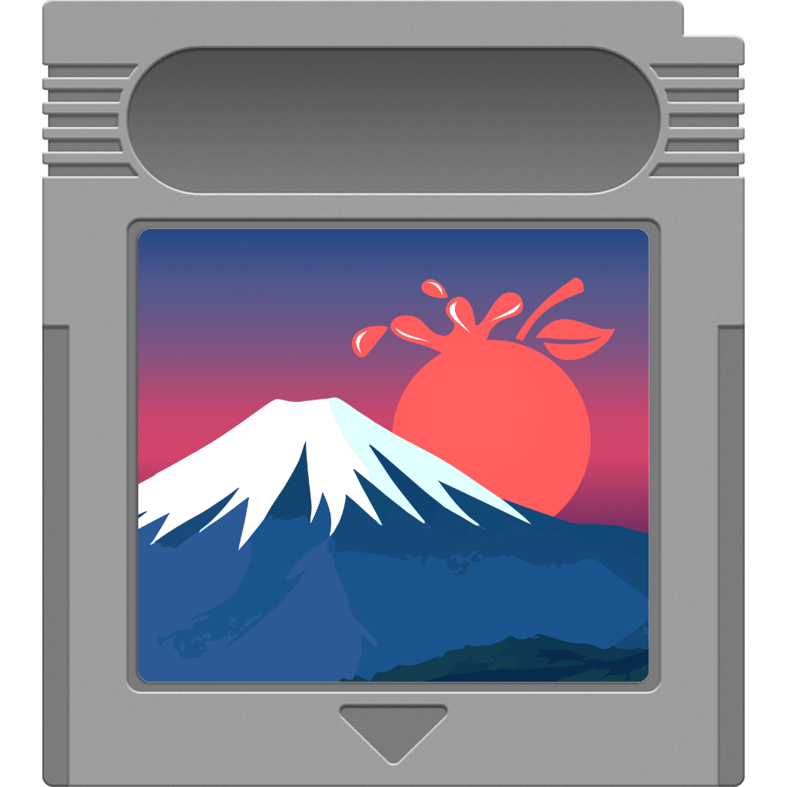

The procedure for starting Fuji in recovery mode is slightly different,
depending on the architecture.

It is recommended that the Mac stays connected to AC plug for the whole
procedure. If the Mac has only one USB port, you may want to use a USB-C dongle
that supports Power Delivery.

## Apple Silicon Macs

Turn off the Mac and connect your **Fuji Cartridge** drive. If you have enough
USB ports, connect the destination drive as well.

Press and hold the power button until you see *Loading startup options...*
then release the button.

<figure class="icon-figure" markdown="span">

<figcaption>Icon of the Fuji Cartridge drive (FujiApp)</figcaption>
</figure>

Look for **FujiApp** in the list of available options and select it.

!!! tip

    Fuji will automatically copy itself to a RAM-disk and start. **After Fuji is
    loaded, you can disconnect the Fuji Cartridge drive** and connect your
    destination drive, if you didn't do it before.

!!! warning

    Please read the **Important notes** section below.

## Intel Macs

Turn off the Mac and connect your **Fuji Cartridge** drive. If you have enough
USB ports, connect the destination drive as well.

Start macOS in recovery mode by pressing and releasing the power button, then
immediately holding ++cmd+r++. Please refer to the [official
Apple website][apple-recovery] in case you are having trouble
starting recovery mode.

After the recovery environment has been loaded, select **Utilities** →
**Terminal** and then issue the following command:

``` bash
/Volumes/FujiApp/start.sh
```

Press ++enter++.

!!! tip

    Fuji will automatically copy itself to a RAM-disk and start. **After Fuji is
    loaded, you can disconnect the Fuji Cartridge drive** and connect your
    destination drive, if you didn't do it before.

!!! warning

    Please read the **Important notes** section below.

## Important notes

1. If the Mac is protected with FileVault, you must provide a valid password.
   Moreover, **you need to unlock the Data volume manually** by running
   *Disk Utility* in the recovery environment.

2. Before starting the acquisition, you must specify on what drive(s) you want
   to store temporary files and the final DMG file. Both values are
   `/Volumes/Fuji` by default and the *image name* parameter will be used to make
   a new directory inside those locations.

3. The values will be pre-filled only if you connected the destination drive
   before starting Fuji.

4. You must not save the disk images on the same drive you are acquiring!

5. Fuji works on Macs running **macOS 10.10 or newer.**

[apple-recovery]: https://support.apple.com/en-us/102518
